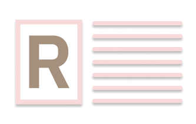

<!-- Readmeify - @readmeify/docs -->

<!-- Top section -->
<p align="center">
  
  <br>
  <h1>Readmeify</h1>
  <h3>The modern `README.md` standard.</h3>
</p>

<!-- Table of contents -->
# 🧂 Table of Contents
- [🧂 Table of Contents](#-table-of-contents)
- [⚙️ Usage](#️-usage)
  - [🎥 Top](#-top)
  - [🍽 Table of contents](#-table-of-contents-1)
  - [🌆 Media](#-media)
  - [📮 Comments](#-comments)
  - [🎛 Format](#-format)
  - [🔷 Headings](#-headings)
  - [⛸ Footer](#-footer)
- [📡 Implementing](#-implementing)
  - [🔻 Small Projects (Personal Accounts)](#-small-projects-personal-accounts)
  - [🫀 Large Projects](#-large-projects)
- [📏 Rules](#-rules)
- [🚀 Contributing](#-contributing)

<!-- Main Usage -->
# ⚙️ Usage
## 🎥 Top
The top of your `README.md` should include a logo (if one exists), a heading, and a subtitle. This is a good template:
```html
<!-- Top section -->
<p align="center">
  
  <br>
  <span align="center">

    <font size="40"><b>readmeify</b></font>
    <br>
    The modern <code>README.md</code> standard.

  </span>
</p>
```
This also aligns the text to the center, which adds a cascade effect, and makes it look better. Logos should have good contrast with the GitHub light and dark theme. The logo has been sized to `175px` to make it fit in better with the readme and spacing.

## 🍽 Table of contents
Table of contents are optional but help the user navigate (quickly) to the desired section. They are to be formatted as follows:
```markdown
# 🧂 Table of Contents
- [🧂 Table of Contents](#-table-of-contents)
- [⚙️ Usage](#️-usage)
  - [🎥 Top](#-top)
  - [🍽 Table of contents](#-table-of-contents-1)
  - [🌆 Media](#-media)
  - [📮 Comments](#-comments)
  - [🎛 Format](#-format)
  - [🔷 Headings](#-headings)
  - [⛸ Footer](#-footer)
- [📡 Implementing](#-implementing)
  - [🔻 Small Projects (Personal Accounts)](#-small-projects-personal-accounts)
  - [🫀 Large Projects](#-large-projects)
- [📏 Rules](#-rules)
- [🚀 Contributing](#-contributing)
```

## 🌆 Media
Any media on a repository should be contained in `assets/`. This makes it easier to organize your repository root. Any sub-categorization can be made as well. For example, screenshots could be in `assets/screenshots/` and could be in `assets/branding/`. Media should also be sized to fit the content better. To size an image in a `README.md` use ``. This maintains the image's aspect ratio while scaling it down to an appropriate size so it does not consume the entire document.

## 📮 Comments
COmments are notated as `<!-- COMMENT -->` in markdown. Comments help seperate parts of your `README.md` into different sections and note something to contributors.

## 🎛 Format
The raw `README.md` file should be formatted in a way that allows you to see a difference between different sections. readmeify recommends this format:
```markdown
# Something
Magna deserunt ad ex sint elit id ex esse ullamco in qui proident.
- List
- Cool


# Something 2
Magna deserunt ad ex sint elit id ex esse ullamco in qui proident.

```
Notice the 2 lines in the middle and no lines between a paragraph and the list. The spacing between the paragraph and list applies to codeblocks and others as well.

## 🔷 Headings
Headings are one of the most important parts of a README. They provide large points and help the eyes travel across the page better. readmeify helps standardize this format by keeping the sizes heirarchical and by adding emoji to the headings in order to draw attention, as the eyes can register colorful icons faster than text, and if these are standardized, peple will be able to reconize them even more. Each repository should have some of the following. All items with an asterisk are expected headings and they are important things that the reader expects to see.

- Main headings ()
  - Usage - ⚙️ `*`
  - Installation - 📡 `*`
  - Development - ⌨️ `*`
  - Contributing - 🚀 `*`
  - Table of Contents - 🧂
  - Community - ✉️
- Subheadings (Add these under the main headings if needed)
  - Running - 🏃 `*`
  - Consistency - 🕊
  - Pull Requests - 🪢
- Other (Add emojis to draw attention)
  - Important - 🔷
  - Warning - 🛑

## ⛸ Footer
The `README.md` should contain a footer that contains links to the organization, repository, info about the license, and optionally, any badges or statistics you would like in your footer. An example footer would look like:
```ht andml
<span align="center">
  <span>
    👼
    <a href="https://github.com/readmeify"> @readmeify/</a>
    <a href="https://github.com/readmeify/docs">docs</a>
  </span>
  •
  <span>👮 MIT License</span>
</span>
```
Notice that at the bottom of this `README.md` there is a small seperator between the footer and the main content. This helps show visual seperation of the footer from the rest of the content. This is recommended in readmeify repositories, but is not required.

# 📡 Implementing

## 🔻 Small Projects (Personal Accounts)
Implementing readmeify on a personal project is as simple as following the [guidelines](#⚙️-usage) and submitting it to our [list repository](https://github.com/readmeify/list).

## 🫀 Large Projects
Large projects with their own dedicated organization have a longer process. Make sure all repositories under your organization follow readmeify standards and that you list all repositories you would like to be listed in an issue on the [list repository](https://github.com/readmeify/list). Your organization and all repositories you choose to be listed will have a link on the main list to another `README.md` for a list of all complying repositories.

# 📏 Rules
1. All rules above must be followed closely.
2. Any requests will be directly listed on our [list repository](https://github.com/readmeify/list), but can and will be removed after violations of our guidelines and if the repository has any controversy around it, we will remove it if it is in our best interests.
3. By submitting a repository to our list, you agree to these rules. 

# 🚀 Contributing
You can create an issue or pull request on the repository if you have any issues with a rule or find any (stupid) mistakes.

<!-- Footer  -->
<p align="center" ></p>

<p align="center">
  <span>
    👼
    <a href="https://github.com/readmeify">@readmeify</a>
  </span>
  ⁄
  <span>
    <a href="https://github.com/readmeify/docs">docs</a>
  </span>
  •
  <span>👮 MIT License</span>
  •
  <span><a href="#-table-of-contents">Jump to Top</a></span>
</p>